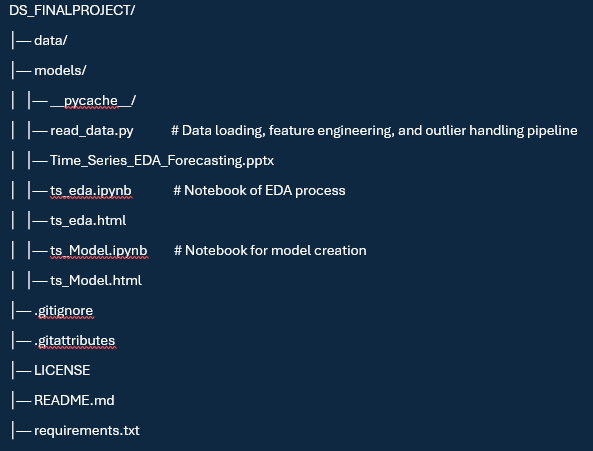
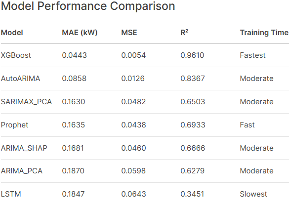

# Time Series Analysis of energy Consumption Data

## Project Overview
This project performs comprehensive time series forecasting of household power consumption using multiple modeling approaches. Key features include:

- Analysis of temporal patterns and external factors affecting energy usage
- Implementation of 6 forecasting models (ARIMA, SARIMAX, Prophet, LSTM, XGBoost, AutoARIMA)
- Hyperparameter optimization using Optuna and feature selection via SHAP/PCA
- Outlier handling using winsorization method
- Performance comparison of different modeling approaches

## Project Structure

## Dataset Description
The dataset contains daily power consumption measurements with environmental variables:
- **Target variable**: `Global_active_power` (household global active power in kW)
- **Key features**: Temperature, humidity, weather conditions
- **Sub-metering** (analysis only, not used in models):
  - `Sub_metering_1`: Kitchen
  - `Sub_metering_2`: Laundry room
  - `Sub_metering_3`: Water heater & AC

## Data Preparation and Exploratory Analysis
The dataset includes household power consumption measurements along with environmental variables such as temperature, humidity, and weather conditions. The primary variable of interest is Global_active_power, which represents global active power consumption in kilowatts. This is the target variable I aim to forecast in this project.

### From EDA to Forecasting models
- The dataset is time-indexed, making it suitable for time series forecasting.
- Several power-related features exhibit high multicollinearity. To avoid introducing bias, I excluded those highly dependent variables and retained only:
    - Historical values of Global_active_power
    - Relevant environmental features
- The Global_active_power distribution is heavily left-skewed. To address this, I applied a log transformation, which improved the distribution. However, even after transformation, a bimodal pattern remains visible.

## Is the Data stationary?
- To assess stationarity, I applied both the ADF (Augmented Dickey-Fuller) and KPSS (Kwiatkowski–Phillips–Schmidt–Shin) tests. A single differencing was sufficient to achieve stationarity, with the following interpretation:
    - adf_stationary = adf_result[1] < 0.05          **Reject null → stationary**
    - kpss_stationary = kpss_result[1] > 0.05        **Fail to reject null → stationary**

### ACF and PACF Analysis
- The Autocorrelation Function (ACF) and Partial Autocorrelation Function (PACF) plots were used to identify appropriate ARIMA model parameters:
    - ACF suggests MA terms (q ≤ 2)
    - PACF suggests AR terms (p ≤ 6)
    - Since differencing was required, we set d = 1

Thus, an initial ARIMA model configuration could be: ARIMA(p=6, d=1, q=2)

- Additionally, the seasonal decomposition of the time series provided useful insights by isolating:
    - Trend
    - Seasonal patterns
    - Residual noise

This analysis supports the model selection and helps validate temporal assumptions.

## Model Implementation
### Forecasting Approaches
1. **ARIMA** (AutoRegressive Integrated Moving Average)
   - Variants: ARIMA_SHAP (feature selection), ARIMA_PCA (dimensionality reduction)
   - Parameters: p=[0-6], d=1, q=[0-2]
   - But optuna choose different parameters..

2. **SARIMAX** (Seasonal ARIMA with eXogenous variables)
   - Incorporates temperature/humidity
   - Seasonal parameters: P=1, D=1, Q=1, m=7

3. **Prophet**
   - Automatic seasonality and holiday detection

4. **LSTM** (Long Short-Term Memory)
   # Optimized LSTM Architecture
   - Sequential([
       LSTM(units, return_sequences=True, input_shape=(30, n_features)),
       BatchNormalization(),
       Dropout(0.3),
       LSTM(units//2),
       BatchNormalization(),
       Dropout(0.3),
       Dense(1)
   ])
    - 30-day lookback window
    - Optuna-tuned hyperparameters
    - Early stopping and learning rate reduction

5.  **XGBoost**
    - SHAP for feature selection (top 20 features)
    - Optuna-optimized hyperparameters

6.  **AutoARIMA**
    - Automated parameter search

For each model, I have used Optuna for hyperparameter tuning to find the optimal configuration. This automated approach helps us find the best parameters without manual trial and error.

## Key Insights
#### XGBoost Performance
    - XGBoost outperformed all other models in terms of both accuracy and computational efficiency.

#### Feature Engineering Impact
    - Feature engineering significantly improved the performance of traditional models:

        - SHAP-selected features allowed the model to focus on the most influential inputs, avoiding the inclusion of irrelevant or redundant - features.

        - PCA (Principal Component Analysis) offered moderate performance improvements by reducing dimensionality and mitigating multicollinearity through transformation into orthogonal components.

#### LSTM Model Challenges

    - Despite extensive architectural tuning, the LSTM model underperformed and did not meet expectations.

    - A likely reason for this is the relatively small dataset size, which may have limited the LSTM’s ability to learn long-term dependencies.

### Temporal Patterns in Energy Consumption

    - Temperature shows a slight negative correlation (-0.12) with energy consumption. While weak, this suggests that as temperature increases, energy usage tends to decrease. This is supported by seasonal observations—winter energy consumption increases by 15–20% compared to warmer months.

    - Clear weekly and seasonal patterns were observed: energy consumption spikes on weekends, especially on Sundays.
